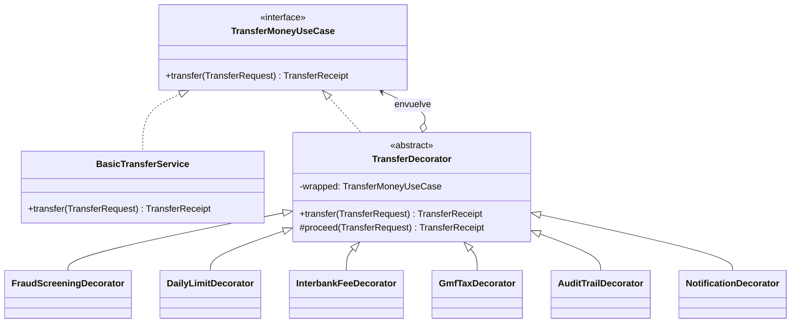

# Banco Ceiba: transferencias con el patrón Decorator

Proyecto académico que muestra el patrón de diseño **Decorator** con un caso real: una **transferencia bancaria en Colombia**. La operación base solo mueve dinero de una cuenta a otra. Encima de ella, el banco agrega capas regulatorias y de negocio: el impuesto 4x1000, la comisión ACH, el tope diario, la revisión de fraude, la auditoría y la notificación por SMS.

> Proyecto sin base de datos (todo en memoria) y sin despliegue en la nube.

---

## 1. El caso de estudio

Cuando una persona transfiere dinero desde la app de su banco, el "core bancario" hace algo muy simple: **debita la cuenta origen y acredita la cuenta destino**. Antes y después de ese movimiento pasan muchas cosas más:

| Capa | Qué pasa en la vida real |
|---|---|
| **Antifraude** | Los bancos retienen transferencias altas hacia destinatarios que el cliente nunca había usado (típico de robo de cuentas). Hace parte del sistema de prevención de lavado y fraude (SARLAFT). |
| **Tope diario** | Cada canal (app, portal, cajero) tiene un monto máximo diario. |
| **Comisión ACH** | Si el dinero va a **otro banco**, la transferencia pasa por ACH Colombia y el banco cobra una comisión. |
| **GMF 4x1000** | El Gravamen a los Movimientos Financieros cobra $4 por cada $1.000 debitados, **salvo** que la cuenta esté marcada como exenta. |
| **Auditoría** | La Superintendencia Financiera exige trazabilidad de las operaciones. |
| **Notificación** | El cliente recibe un SMS con el resultado. |

Estas capas **no se programan dentro** del servicio de transferencia: se agregan alrededor de él, se activan o desactivan según el producto, el canal o la regulación, y **su orden importa**. Ese es justamente el problema que resuelve el patrón Decorator: **agregar responsabilidades a un objeto de forma dinámica, sin modificar su clase y sin crear una subclase por cada combinación** (con 6 capas habría 2⁶ = 64 combinaciones posibles).

---

## 2. El patrón en el código



| Rol del patrón | Clase |
|---|---|
| **Component** | `domain/port/in/TransferMoneyUseCase`: el puerto de entrada que todos implementan |
| **ConcreteComponent** | `application/service/BasicTransferService`: débito y crédito, nada más |
| **Decorator** | `application/decorator/TransferDecorator`: clase abstracta que guarda la referencia al objeto envuelto y delega en `proceed()` |
| **ConcreteDecorators** | Los 6 decoradores de la sección 3 |
| **Cliente / ensamblador** | `infrastructure/config/TransferChainFactory`: arma la cadena en tiempo de ejecución |

Como cada decorador **es** un `TransferMoneyUseCase` y **tiene** un `TransferMoneyUseCase`, se pueden apilar en cualquier orden:

```java
TransferMoneyUseCase chain =
    new AuditTrailDecorator(
        new NotificationDecorator(
            new FraudScreeningDecorator(
                new DailyLimitDecorator(
                    new GmfTaxDecorator(
                        new InterbankFeeDecorator(
                            new BasicTransferService(accounts), accounts), accounts), accounts), accounts),
            sms),
        auditLog);
```

Cada decorador agrega su propia línea al **comprobante** (`TransferReceipt`), así que en la interfaz se ve exactamente qué capas participaron.

---

## 3. Los decoradores

Hay dos tipos de decoradores según **cuándo** actúan:

- **Previos (pueden cortar la cadena):** revisan la solicitud **antes** de llamar a `proceed()`. Si algo falla, devuelven un comprobante rechazado o retenido y **la transferencia base nunca se ejecuta**.
- **Posteriores:** llaman primero a `proceed()` y, si la transferencia fue aprobada, agregan cobros o efectos.

### 3.1 `FraudScreeningDecorator`: Antifraude (previo)
- **Regla:** si el destinatario es **nuevo** para el cliente y el monto supera **$2.000.000**, la transferencia queda **RETENIDA** (`ON_HOLD`).
- **Después:** si la transferencia fue aprobada, registra al destinatario como conocido.
- **Ejemplo:** Laura (1001) envía $2.500.000 a Marta (2002), a quien nunca le había transferido, y la operación queda retenida.

### 3.2 `DailyLimitDecorator`: Tope diario (previo)
- **Regla:** lo transferido hoy más el nuevo monto no puede superar **$3.000.000**. Si lo supera, la transferencia queda **RECHAZADA**.
- **Después:** suma el monto al acumulado diario de la cuenta.

### 3.3 `InterbankFeeDecorator`: Comisión ACH (posterior)
- **Regla:** si la cuenta origen y la destino son de **bancos diferentes**, debita **$7.900** de comisión.
- **Ejemplo:** Banco Ceiba hacia Banco Cordillera.

### 3.4 `GmfTaxDecorator`: GMF 4x1000 (posterior)
- **Regla:** cobra el **0,4 %** de **todo lo debitado hasta ese momento** en el comprobante. Si la cuenta es exenta (ej. cuenta de nómina marcada como exenta), solo deja constancia y no cobra nada.
- Este es el decorador donde **el orden cambia el dinero cobrado** (ver sección 4).

### 3.5 `AuditTrailDecorator`: Auditoría (previo y posterior)
- Registra el **intento** antes de delegar y el **resultado** después.
- Solo audita lo que ocurre **dentro** de su capa: si un decorador más externo corta la cadena, la auditoría ni se entera.

### 3.6 `NotificationDecorator`: Notificación SMS (posterior)
- Envía un SMS simulado (por consola y en la bitácora de la interfaz) con el estado final y el total debitado.

---

## 4. ¿Por qué importa el orden?

La lista de capas en la interfaz va **de afuera hacia adentro**. La primera capa es la más externa: es la primera en recibir la solicitud y la última en procesar la respuesta.

**Ejemplo real con Andrés (1002) enviando $500.000 a Comercial Andina (2001, otro banco):**

| Orden | Cálculo del GMF | Total debitado |
|---|---|---|
| `GMF` → `ACH` (GMF por fuera) | 4x1000 sobre $500.000 + $7.900 = **$2.032** | **$509.932** |
| `ACH` → `GMF` (GMF por dentro) | 4x1000 sobre $500.000 = **$2.000** | **$509.900** |

En Colombia el 4x1000 también aplica sobre las comisiones debitadas, así que el orden correcto es el **GMF por fuera de la comisión ACH**.

Otros efectos del orden:
- **Auditoría por fuera del antifraude:** las transferencias retenidas **sí** quedan en la bitácora. Si la auditoría va por dentro, los intentos bloqueados no se registran.
- **Notificación por dentro del tope diario:** si la transferencia supera el tope, el cliente **no** recibe SMS.

---

## 5. Arquitectura hexagonal

```
src/main/java/co/ceiba/transfers/
├── Application.java                  # Punto de entrada: conecta adaptadores y arranca el servidor
├── domain/                           # Núcleo: no depende de nada externo
│   ├── model/                        # Account, TransferRequest, TransferReceipt, ReceiptLine, TransferStatus
│   ├── exception/                    # InsufficientFundsException, AccountNotFoundException
│   └── port/
│       ├── in/                       # TransferMoneyUseCase (Component del patrón)
│       └── out/                      # AccountRepository, AuditLog, NotificationSender
├── application/
│   ├── service/                      # BasicTransferService (ConcreteComponent)
│   └── decorator/                    # TransferDecorator + 6 decoradores concretos
└── infrastructure/
    ├── adapter/in/web/               # Handlers HTTP (API REST) y servidor de archivos estáticos
    ├── adapter/out/memory/           # Repositorio de cuentas y bitácora en memoria
    ├── adapter/out/notification/     # SMS simulado por consola
    └── config/                       # TransferChainFactory y DecoratorType
src/main/resources/static/            # Interfaz web (HTML, CSS, JS)
```

- El **dominio** define los puertos y no conoce HTTP ni la memoria.
- Los **decoradores** viven en la capa de aplicación y solo dependen de puertos.
- La **infraestructura** implementa los puertos y decide, con la `TransferChainFactory`, qué decoradores envuelven al servicio base.

---

## 6. Cómo ejecutar

Requisito: **JDK 17 o superior** (no se necesita ninguna dependencia externa; el servidor usa `com.sun.net.httpserver` del propio JDK).

```bash
./run.sh
```

Con Maven instalado también se puede usar:

```bash
mvn compile exec:java
```

Luego abrir **http://localhost:8080**.

### Cuentas de prueba

| Cuenta | Titular | Banco | Saldo inicial | Nota |
|---|---|---|---|---|
| 1001 | Laura Gómez | Banco Ceiba | $8.500.000 | Exenta de GMF, conoce a 1002 |
| 1002 | Andrés Rojas | Banco Ceiba | $2.300.000 | Conoce a 1001 |
| 2001 | Comercial Andina S.A.S. | Banco Cordillera | $15.000.000 | |
| 2002 | Marta Ruiz | Banco Cordillera | $640.000 | |

### Escenarios sugeridos

1. **Interbancaria con impuestos:** 1002 envía $500.000 a 2001. Se cobran la comisión ACH y el GMF.
2. **Cambiar el orden:** se sube la capa *Comisión ACH* por encima de *GMF* y se repite la transferencia. El total cambia.
3. **Cuenta exenta:** 1001 envía $100.000 a 1002. El GMF aparece como "Cuenta exenta".
4. **Fraude:** 1001 envía $2.500.000 a 2002. La transferencia queda retenida.
5. **Tope diario:** 1001 envía $3.500.000 a 1002. La transferencia queda rechazada.
6. **Sin decoradores:** se desactivan todas las capas. Solo se mueve el dinero.

### API

| Método | Ruta | Descripción |
|---|---|---|
| `GET` | `/api/accounts` | Lista de cuentas y saldos |
| `POST` | `/api/transfers` | Campos: `source`, `target`, `amount`, `decorators` (separados por coma, de afuera hacia adentro) |
| `GET` | `/api/audit` | Bitácora de auditoría y SMS enviados |

---

## 7. Equipo

| Integrante | Responsabilidad |
|---|---|
| **NicoalsD** | Estructura del proyecto, dominio, servicio base, adaptadores y API web |
| **Juanda-11** | Decoradores y fábrica de la cadena |
| **sthebanHV** | Interfaz web y documentación |

Convenciones de ramas y commits en [`AGENTS.md`](AGENTS.md).
