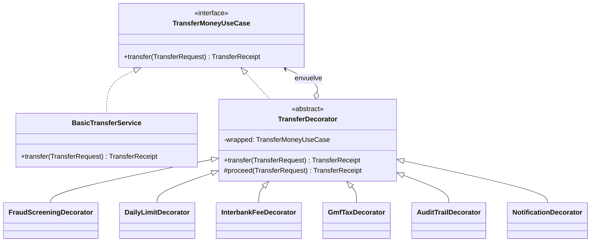

# Banco Ceiba: Decorator, Prototype, Builder y Abstract Factory

Proyecto académico que muestra el patrón de diseño **Decorator** con un caso real: una **transferencia bancaria en Colombia**. La operación base solo mueve dinero de una cuenta a otra. Encima de ella, el banco agrega capas regulatorias y de negocio: el impuesto 4x1000, la comisión ACH, el tope diario, la revisión de fraude, la auditoría y la notificación por SMS.

> Backend en Java 17, interfaz web incluida y despliegue mediante contenedor en Vercel. Los datos de demostración se guardan en memoria.

---

## 1. El caso de estudio

Cuando una persona transfiere dinero desde la app de su banco, el "core bancario" hace algo muy simple: **debita la cuenta origen y acredita la cuenta destino**. Antes y después de ese movimiento pasan muchas cosas más:

| Capa | Qué pasa en la vida real |
|---|---|
| **Antifraude** | Los bancos retienen transferencias altas hacia destinatarios que el cliente nunca había usado (típico de robo de cuentas). Hace parte del sistema de prevención de lavado y fraude (SARLAFT). |
| **Tope diario** | Cada canal (app, portal, cajero) tiene un monto máximo diario. |
| **Comisión ACH** | Si el dinero va a **otro banco**, la transferencia pasa por ACH Colombia y el banco cobra una comisión. |
| **GMF 4x1000** | El Gravamen a los Movimientos Financieros cobra $4 por cada $1.000 debitados, **salvo** que la cuenta esté marcada como exenta. |
| **Auditoría** | La Superintendencia Financiera exige trazabilidad de las operaciones. |
| **Notificación** | El cliente recibe un SMS con el resultado. |

Estas capas **no se programan dentro** del servicio de transferencia: se agregan alrededor de él, se activan o desactivan según el producto, el canal o la regulación, y **su orden importa**. Ese es justamente el problema que resuelve el patrón Decorator: **agregar responsabilidades a un objeto de forma dinámica, sin modificar su clase y sin crear una subclase por cada combinación** (con 6 capas habría 2⁶ = 64 combinaciones posibles).

---

## 2. El patrón en el código



| Rol del patrón | Clase |
|---|---|
| **Component** | `domain/port/in/TransferMoneyUseCase`: el puerto de entrada que todos implementan |
| **ConcreteComponent** | `application/service/BasicTransferService`: débito y crédito, nada más |
| **Decorator** | `application/decorator/TransferDecorator`: clase abstracta que guarda la referencia al objeto envuelto y delega en `proceed()` |
| **ConcreteDecorators** | Los 6 decoradores de la sección 3 |
| **Cliente / ensamblador** | `infrastructure/config/TransferChainFactory`: arma la cadena en tiempo de ejecución |

Como cada decorador **es** un `TransferMoneyUseCase` y **tiene** un `TransferMoneyUseCase`, se pueden apilar en cualquier orden:

```java
TransferMoneyUseCase chain =
    new AuditTrailDecorator(
        new NotificationDecorator(
            new FraudScreeningDecorator(
                new DailyLimitDecorator(
                    new GmfTaxDecorator(
                        new InterbankFeeDecorator(
                            new BasicTransferService(accounts), accounts), accounts), accounts), accounts),
            sms),
        auditLog);
```

Cada decorador agrega su propia línea al **comprobante** (`TransferReceipt`), así que en la interfaz se ve exactamente qué capas participaron.

---

## 3. Los decoradores

Hay dos tipos de decoradores según **cuándo** actúan:

- **Previos (pueden cortar la cadena):** revisan la solicitud **antes** de llamar a `proceed()`. Si algo falla, devuelven un comprobante rechazado o retenido y **la transferencia base nunca se ejecuta**.
- **Posteriores:** llaman primero a `proceed()` y, si la transferencia fue aprobada, agregan cobros o efectos.

### 3.1 `FraudScreeningDecorator`: Antifraude (previo)
- **Regla:** si el destinatario es **nuevo** para el cliente y el monto supera **$2.000.000**, la transferencia queda **RETENIDA** (`ON_HOLD`).
- **Después:** si la transferencia fue aprobada, registra al destinatario como conocido.
- **Ejemplo:** Laura (1001) envía $2.500.000 a Marta (2002), a quien nunca le había transferido, y la operación queda retenida.

### 3.2 `DailyLimitDecorator`: Tope diario (previo)
- **Regla:** lo transferido hoy más el nuevo monto no puede superar **$3.000.000**. Si lo supera, la transferencia queda **RECHAZADA**.
- **Después:** suma el monto al acumulado diario de la cuenta.

### 3.3 `InterbankFeeDecorator`: Comisión ACH (posterior)
- **Regla:** si la cuenta origen y la destino son de **bancos diferentes**, debita **$7.900** de comisión.
- **Ejemplo:** Banco Ceiba hacia Banco Cordillera.

### 3.4 `GmfTaxDecorator`: GMF 4x1000 (posterior)
- **Regla:** cobra el **0,4 %** de **todo lo debitado hasta ese momento** en el comprobante. Si la cuenta es exenta (ej. cuenta de nómina marcada como exenta), solo deja constancia y no cobra nada.
- Este es el decorador donde **el orden cambia el dinero cobrado** (ver sección 4).

### 3.5 `AuditTrailDecorator`: Auditoría (previo y posterior)
- Registra el **intento** antes de delegar y el **resultado** después.
- Solo audita lo que ocurre **dentro** de su capa: si un decorador más externo corta la cadena, la auditoría ni se entera.

### 3.6 `NotificationDecorator`: Notificación SMS (posterior)
- Envía un SMS simulado (por consola y en la bitácora de la interfaz) con el estado final y el total debitado.

---

## 4. ¿Por qué importa el orden?

La lista de capas en la interfaz va **de afuera hacia adentro**. La primera capa es la más externa: es la primera en recibir la solicitud y la última en procesar la respuesta.

**Ejemplo real con Andrés (1002) enviando $500.000 a Comercial Andina (2001, otro banco):**

| Orden | Cálculo del GMF | Total debitado |
|---|---|---|
| `GMF` → `ACH` (GMF por fuera) | 4x1000 sobre $500.000 + $7.900 = **$2.032** | **$509.932** |
| `ACH` → `GMF` (GMF por dentro) | 4x1000 sobre $500.000 = **$2.000** | **$509.900** |

En Colombia el 4x1000 también aplica sobre las comisiones debitadas, así que el orden correcto es el **GMF por fuera de la comisión ACH**.

Otros efectos del orden:
- **Auditoría por fuera del antifraude:** las transferencias retenidas **sí** quedan en la bitácora. Si la auditoría va por dentro, los intentos bloqueados no se registran.
- **Notificación por dentro del tope diario:** si la transferencia supera el tope, el cliente **no** recibe SMS.

---

## 5. Arquitectura hexagonal

```
src/main/java/co/ceiba/transfers/
├── Application.java                  # Punto de entrada: conecta adaptadores y arranca el servidor
├── domain/                           # Núcleo: no depende de nada externo
│   ├── model/                        # Account, TransferRequest, TransferRequestBuilder, TransferTemplate, TransferPolicy y comprobantes
│   ├── exception/                    # InsufficientFundsException, AccountNotFoundException
│   └── port/
│       ├── in/                       # TransferMoneyUseCase (Component del patrón)
│       └── out/                      # AccountRepository, AuditLog, NotificationSender
├── application/
│   ├── service/                      # BasicTransferService y TransferTemplateService
│   ├── decorator/                    # TransferDecorator + 6 decoradores concretos
│   └── factory/                      # TransferProfileFactory y fábricas interna/interbancaria
└── infrastructure/
    ├── adapter/in/web/               # Handlers HTTP (API REST) y servidor de archivos estáticos
    ├── adapter/out/memory/           # Repositorio de cuentas y bitácora en memoria
    ├── adapter/out/notification/     # SMS simulado por consola
    └── config/                       # TransferChainFactory y DecoratorType
src/main/resources/static/            # Interfaz web (HTML, CSS, JS)
```

- El **dominio** define los puertos y no conoce HTTP ni la memoria.
- Los **decoradores** viven en la capa de aplicación y solo dependen de puertos.
- La **infraestructura** implementa los puertos y decide, con la `TransferChainFactory`, qué decoradores envuelven al servicio base.

---

## 6. Cómo ejecutar

Requisito: **JDK 17 o superior** (no se necesita ninguna dependencia externa; el servidor usa `com.sun.net.httpserver` del propio JDK).

```bash
./run.sh
```

Con Maven instalado también se puede usar:

```bash
mvn compile exec:java
```

Luego abrir **http://localhost:8080**.

### Cuentas de prueba

| Cuenta | Titular | Banco | Saldo inicial | Nota |
|---|---|---|---|---|
| 1001 | Laura Gómez | Banco Ceiba | $8.500.000 | Exenta de GMF, conoce a 1002 |
| 1002 | Andrés Rojas | Banco Ceiba | $2.300.000 | Conoce a 1001 |
| 2001 | Comercial Andina S.A.S. | Banco Cordillera | $15.000.000 | |
| 2002 | Marta Ruiz | Banco Cordillera | $640.000 | |

### Escenarios sugeridos

1. **Interbancaria con impuestos:** 1002 envía $500.000 a 2001. Se cobran la comisión ACH y el GMF.
2. **Cambiar el orden:** se sube la capa *Comisión ACH* por encima de *GMF* y se repite la transferencia. El total cambia.
3. **Cuenta exenta:** 1001 envía $100.000 a 1002. El GMF aparece como "Cuenta exenta".
4. **Fraude:** 1001 envía $2.500.000 a 2002. La transferencia queda retenida.
5. **Tope diario:** 1001 envía $3.500.000 a 1002. La transferencia queda rechazada.
6. **Sin decoradores:** se desactivan todas las capas. Solo se mueve el dinero.

### API

| Método | Ruta | Descripción |
|---|---|---|
| `GET` | `/api/accounts` | Lista de cuentas y saldos |
| `POST` | `/api/transfers` | Campos: `source`, `target`, `amount`, `decorators` (separados por coma, de afuera hacia adentro) |
| `GET` | `/api/audit` | Bitácora de auditoría y SMS enviados |
| `GET` | `/api/templates` | Plantillas predefinidas y copias guardadas |
| `POST` | `/api/templates` | Guarda una copia. Campos: `prototypeId`, `name`, `source`, `target`, `amount`, `decorators` |

---

## 7. Nueva funcionalidad: plantillas reutilizables

La sección **Plantillas reutilizables** permite cargar una configuración y guardar una copia con otro nombre, cuentas, monto u orden de capas. Guardar una plantilla no transfiere dinero. Para ejecutarla, se carga y se pulsa **Transferir**.

Se incluyen dos familias: **Entre cuentas Ceiba**, sin comisión ACH en su configuración inicial, y **Transferencia interbancaria**, con GMF por fuera de la comisión ACH.

Los patrones creacionales crean las configuraciones reutilizables y **Decorator** ejecuta sus capas de negocio. La ubicación exacta de cada implementación se detalla en la sección 8.

La funcionalidad se conecta mediante `TransferTemplateService`, el puerto `TransferTemplateRepository`, su adaptador en memoria y `TemplatesHandler`. El dominio sigue sin depender de HTTP ni de infraestructura. Todo el backend y los patrones están implementados en Java; el navegador utiliza la interfaz HTML, CSS y JavaScript del proyecto.

Para usarla:

1. Elegir una plantilla y pulsar **Cargar plantilla**.
2. Ajustar cuentas, monto o capas.
3. Escribir un nombre y pulsar **Guardar configuración actual**.
4. Seleccionar la nueva copia, cargarla y transferir cuando se desee.

## 8. Dónde está implementado cada patrón

Todas las rutas siguientes son relativas a la raíz del repositorio. Los enlaces abren directamente los archivos cuando este README se visualiza en GitHub.

| Patrón | Archivo principal | Función en la aplicación |
|---|---|---|
| **Decorator** | [TransferDecorator.java](src/main/java/co/ceiba/transfers/application/decorator/TransferDecorator.java) | Envuelve un `TransferMoneyUseCase` y delega mediante `proceed()` para agregar controles, cobros o efectos |
| **Prototype** | [TransferTemplate.java](src/main/java/co/ceiba/transfers/domain/model/TransferTemplate.java) | `copy(newId, newName)` duplica la plantilla con una solicitud nueva y una lista inmutable; `withConfiguration()` aplica la configuración de la copia |
| **Builder** | [TransferRequestBuilder.java](src/main/java/co/ceiba/transfers/domain/model/TransferRequestBuilder.java) | Construye solicitudes con `source()`, `target()`, `amount()` y `build()`; la validación final reside en `TransferRequest` |
| **Abstract Factory** | [TransferProfileFactory.java](src/main/java/co/ceiba/transfers/application/factory/TransferProfileFactory.java) | Define la creación de dos productos relacionados: una plantilla y su política de decoradores |

### Decorator: clases y ensamblaje

- **Componente:** [TransferMoneyUseCase.java](src/main/java/co/ceiba/transfers/domain/port/in/TransferMoneyUseCase.java).
- **Componente concreto:** [BasicTransferService.java](src/main/java/co/ceiba/transfers/application/service/BasicTransferService.java), que debita la cuenta origen y acredita la cuenta destino.
- **Decorador base:** [TransferDecorator.java](src/main/java/co/ceiba/transfers/application/decorator/TransferDecorator.java).
- **Antifraude:** [FraudScreeningDecorator.java](src/main/java/co/ceiba/transfers/application/decorator/FraudScreeningDecorator.java).
- **Tope diario:** [DailyLimitDecorator.java](src/main/java/co/ceiba/transfers/application/decorator/DailyLimitDecorator.java).
- **Comisión ACH:** [InterbankFeeDecorator.java](src/main/java/co/ceiba/transfers/application/decorator/InterbankFeeDecorator.java).
- **GMF:** [GmfTaxDecorator.java](src/main/java/co/ceiba/transfers/application/decorator/GmfTaxDecorator.java).
- **Auditoría:** [AuditTrailDecorator.java](src/main/java/co/ceiba/transfers/application/decorator/AuditTrailDecorator.java).
- **SMS:** [NotificationDecorator.java](src/main/java/co/ceiba/transfers/application/decorator/NotificationDecorator.java).
- **Ensamblador:** [TransferChainFactory.java](src/main/java/co/ceiba/transfers/infrastructure/config/TransferChainFactory.java) arma la cadena en el orden elegido por el usuario. Esta clase ensambla decoradores; la implementación de Abstract Factory está en `application/factory/`.

### Prototype: copia de plantillas

El prototipo está en [TransferTemplate.java](src/main/java/co/ceiba/transfers/domain/model/TransferTemplate.java). [TransferTemplateService.saveCopy()](src/main/java/co/ceiba/transfers/application/service/TransferTemplateService.java) busca la plantilla seleccionada, llama a `copy()` con un UUID nuevo y aplica los valores del formulario. La configuración original permanece independiente.

La copia se almacena mediante el puerto [TransferTemplateRepository.java](src/main/java/co/ceiba/transfers/domain/port/out/TransferTemplateRepository.java) y el adaptador [InMemoryTransferTemplateRepository.java](src/main/java/co/ceiba/transfers/infrastructure/adapter/out/memory/InMemoryTransferTemplateRepository.java).

### Builder: construcción de solicitudes

[TransferRequestBuilder.java](src/main/java/co/ceiba/transfers/domain/model/TransferRequestBuilder.java) construye [TransferRequest.java](src/main/java/co/ceiba/transfers/domain/model/TransferRequest.java), que exige cuentas presentes y distintas y un monto positivo. El builder se utiliza en [TransfersHandler.java](src/main/java/co/ceiba/transfers/infrastructure/adapter/in/web/TransfersHandler.java), [TemplatesHandler.java](src/main/java/co/ceiba/transfers/infrastructure/adapter/in/web/TemplatesHandler.java) y las dos fábricas concretas.

### Abstract Factory: familias de transferencias

- **Interfaz de fábrica:** [TransferProfileFactory.java](src/main/java/co/ceiba/transfers/application/factory/TransferProfileFactory.java), con `createTemplate()` y `createPolicy()`.
- **Familia interna:** [InternalTransferFactory.java](src/main/java/co/ceiba/transfers/application/factory/InternalTransferFactory.java), que crea una plantilla entre cuentas Ceiba y una política inicial sin ACH.
- **Familia interbancaria:** [InterbankTransferFactory.java](src/main/java/co/ceiba/transfers/application/factory/InterbankTransferFactory.java), que crea la plantilla interbancaria y su política con GMF por fuera de ACH.
- **Productos:** [TransferTemplate.java](src/main/java/co/ceiba/transfers/domain/model/TransferTemplate.java) y [TransferPolicy.java](src/main/java/co/ceiba/transfers/domain/model/TransferPolicy.java).
- **Cliente:** [TransferTemplateService.java](src/main/java/co/ceiba/transfers/application/service/TransferTemplateService.java) crea las plantillas iniciales y selecciona la fábrica según los bancos de las cuentas al guardar una copia.

### Cómo se conectan en la nueva funcionalidad

1. [Application.java](src/main/java/co/ceiba/transfers/Application.java) conecta el servicio, los repositorios y la ruta `/api/templates`.
2. Las fábricas crean las dos familias de plantillas y políticas iniciales.
3. Al guardar una plantilla, `TemplatesHandler` usa **Builder** para crear la solicitud y `TransferTemplateService` usa **Prototype** para guardar una copia independiente.
4. Al pulsar **Transferir**, `TransfersHandler` construye la solicitud y `TransferChainFactory` ejecuta la cadena **Decorator** seleccionada.
5. La interacción del navegador está en [index.html](src/main/resources/static/index.html) y [app.js](src/main/resources/static/app.js).

## 9. Subir los cambios a GitHub

La carpeta ya contiene el repositorio Git con el remoto `origin` apuntando a **https://github.com/JhonRamirez22/decorator-pattern2.git**. Los cambios están en la rama **feature/vercel-deployment**. No es necesario ejecutar `git init` ni volver a clonar.

Cuando quieras publicar los archivos, ejecuta desde la raíz del proyecto:

~~~bash
git status --short
git add .
git commit -m "feature: add transfer templates and Java container deployment"
git push -u origin feature/vercel-deployment
~~~

Estos comandos son instrucciones para quien publique el proyecto: no se ejecutaron commits ni push durante la preparación local. Usa tu identidad de Git y acceso de escritura al repositorio.

Después del push, abre un **Pull Request** desde `feature/vercel-deployment` hacia `main`. Las [convenciones del proyecto](AGENTS.md) requieren integrar mediante una rama. Una vez integrado el PR, `main` contendrá los patrones, la interfaz actualizada y `Dockerfile.vercel` para desplegar en producción.

[.gitignore](.gitignore) excluye los archivos compilados, las configuraciones locales de Vercel y los archivos de variables de entorno. GitHub recibirá los fuentes y las instrucciones de compilación; el JAR se genera durante el build.

## 10. Compilación y despliegue en Vercel

El proyecto no necesita Node.js ni npm. Para generar el JAR con JDK 17 o superior:

~~~bash
./build.sh
java -jar target/decorator-pattern.jar
~~~

`./run.sh` compila y arranca la misma aplicación. El puerto local es **8080** y se puede cambiar mediante la variable `PORT`.

El archivo **Dockerfile.vercel** compila los fuentes Java, incluye la interfaz web en el JAR y ejecuta el servidor sobre un JRE 17. La aplicación escucha en `PORT`, con valor **80** en el contenedor, y sirve frontend y API bajo el mismo dominio.

Vercel [admite Dockerfile.vercel para desplegar servidores HTTP, incluido Java](https://vercel.com/changelog/bring-your-dockerfile-to-vercel-functions). Para subir este proyecto:

1. Publicar la rama y completar el Pull Request descrito en la sección 9. Esto evita desplegar el `main` anterior, que todavía no contiene estos archivos.
2. En Vercel, elegir **Add New → Project** e importar `JhonRamirez22/decorator-pattern2`.
3. Usar la raíz del repositorio como **Root Directory**; dejar el campo vacío cuando el proyecto está en la raíz.
4. Dejar que Vercel detecte [Dockerfile.vercel](Dockerfile.vercel). Si se solicita un preset, elegir **Container**. Mantener los ajustes predeterminados del contenedor, sin configurar `target/` como directorio de salida estático.
5. Usar **main** como **Production Branch** después de integrar el PR. La rama de trabajo puede usarse antes para un despliegue de preview.
6. Pulsar **Deploy**. El contenedor compila los fuentes Java y sirve tanto `/` como `/api/*`. No requiere variables secretas, base de datos ni una URL de backend separada para esta demostración.
7. Abrir el dominio generado y comprobar `/api/accounts` y `/api/templates`; luego cargar una plantilla y ejecutar una transferencia desde la interfaz.

La [documentación de Vercel sobre contenedores](https://vercel.com/kb/guide/docker) explica la detección automática de `Dockerfile.vercel` y el puerto HTTP. No se añade `vercel.json`: este proyecto utiliza un único contenedor que sirve la aplicación completa.

| Archivo | Preparación para el despliegue |
|---|---|
| [Dockerfile.vercel](Dockerfile.vercel) | Build en JDK 17 y ejecución en JRE 17 con frontend incluido |
| [.dockerignore](.dockerignore) | Incluye los fuentes necesarios y excluye el resto del contexto local |
| [Application.java](src/main/java/co/ceiba/transfers/Application.java) | Lee `PORT` y registra las rutas de frontend y API |
| [build.sh](build.sh) | Genera un JAR ejecutable usando solamente el JDK |
| [pom.xml](pom.xml) | Permite compilar y empaquetar con Maven y define la clase principal |
| [.gitattributes](.gitattributes) | Conserva finales de línea LF en los scripts y fuentes |

La compilación y las rutas de la aplicación se comprobaron en local. El build Docker debe ejecutarse con un daemon Docker activo; el despliegue remoto se confirma cuando Vercel complete su build y entregue una URL.

También se puede construir el contenedor localmente:

~~~bash
docker build -f Dockerfile.vercel -t banco-ceiba .
docker run --rm -p 8080:80 banco-ceiba
~~~

**Persistencia:** esta es una demostración académica en memoria. Saldos, destinatarios conocidos, acumulados, bitácoras y plantillas nuevas se reinician al detener o reemplazar el servidor. Las instancias escaladas de Vercel no comparten esa memoria. Para conservar datos entre reinicios o instancias se requiere añadir un adaptador de base de datos.

## 11. Equipo

| Integrante | Responsabilidad |
|---|---|
| **NicoalsD** | Estructura del proyecto, dominio, servicio base, adaptadores y API web |
| **Juanda-11** | Decoradores y fábrica de la cadena |
| **sthebanHV** | Interfaz web y documentación |

Convenciones de ramas y commits en [`AGENTS.md`](AGENTS.md).
